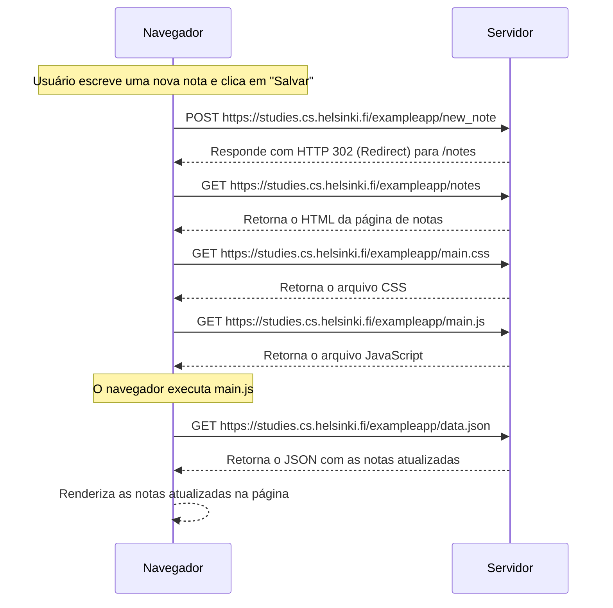

1. O usuário digita uma nova nota no campo de texto e pressiona “Salvar”.  
2. O navegador envia um **POST** para `/new_note` com o conteúdo da nota.  
3. O servidor responde com um **HTTP 302** redirecionando o navegador para `/notes`.  
4. O navegador então faz um **GET** em `/notes`, e o servidor retorna o HTML da página.  
5. Em seguida, o navegador baixa novamente os arquivos **main.css** e **main.js**.  
6. O **main.js** é executado, e ele faz um **GET** em `/data.json` para obter todas as notas.  
7. Por fim, o navegador **renderiza as notas atualizadas** na tela.
---