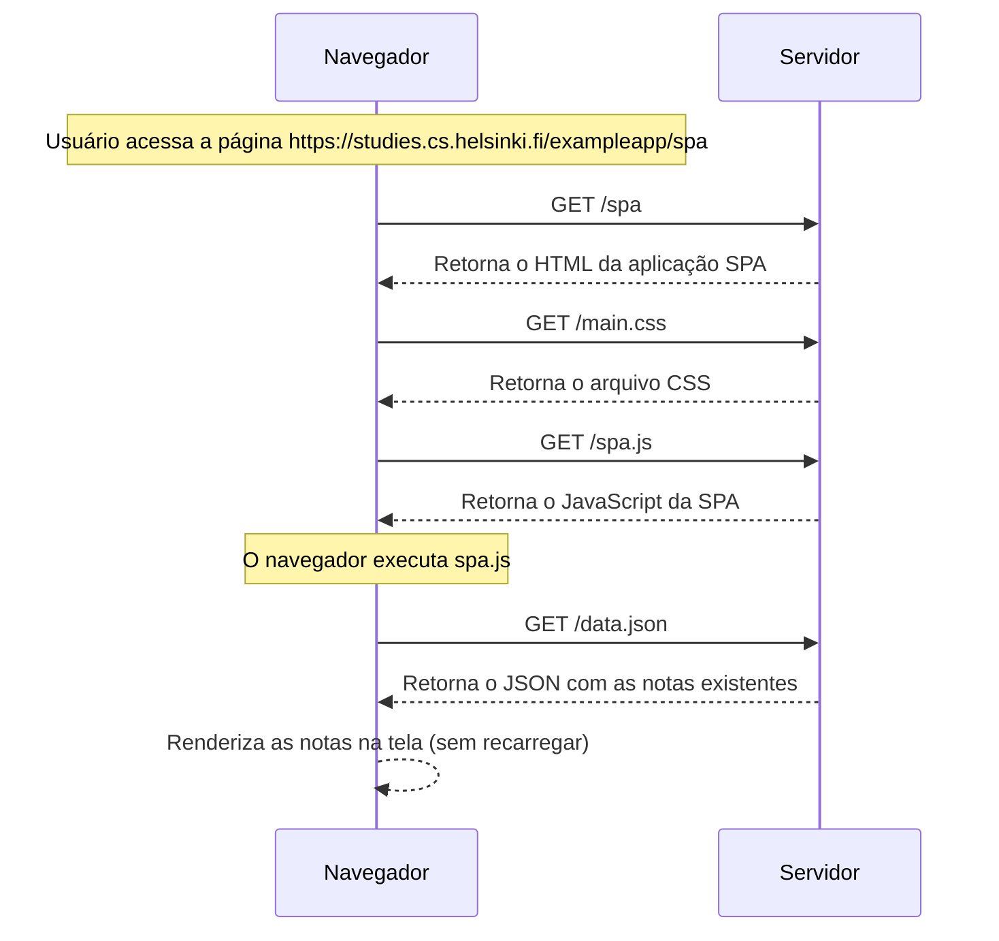

1. O navegador pede o HTML da página SPA.  
2. Baixa o CSS (`main.css`).  
3. Baixa e executa o JS (`spa.js`).  
4. O script solicita os dados das notas (`data.json`).  
5. O navegador renderiza as notas na tela.